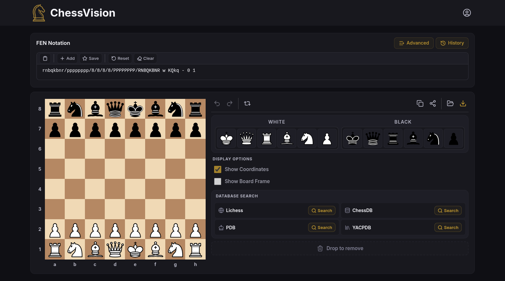

# ChessVision

[](LICENSE)
[](CONTRIBUTING.md)

ChessVision is a browser-based chess diagram editor. Set up any position, choose how the board looks, and export a sharp image at the resolution you need — for print, a blog post, or a video thumbnail. No installation, no account required.

**[chessvision.org](https://chessvision.org)** · [Report a bug](https://github.com/chessvision-org/chess-vision/issues) · [Request a feature](https://github.com/chessvision-org/chess-vision/issues)

---



---

## Getting started

**Requirements:** Node.js 22 or later, pnpm 10 or later.

```bash
git clone https://github.com/chessvision-org/chess-vision.git
cd chess-vision
pnpm install
pnpm dev
```

Open [http://localhost:3000](http://localhost:3000).

```bash
pnpm build      # production build → dist/
pnpm validate   # typecheck, lint, format check, tests
```

### Docker

```bash
# Production
docker compose up --build -d web       # http://localhost:3000

# Development with HMR
docker compose --profile dev up --build dev   # http://localhost:5173
```

---

## What it does

- **Board editor** — drag pieces onto any square, flip the board, toggle coordinates and border frame
- **FEN input** — paste any FEN string with real-time validation; batch input supports up to 10 positions at once
- **Export** — PNG, JPEG, or SVG at four quality presets (300–1200 DPI); batch export downloads a ZIP; DPI metadata is embedded in the file
- **Board customisation** — 23 piece sets, 20 preset themes, custom colour picker, up to 48 saved presets
- **Position history** — saved locally with favourites, pinning, freshness indicators, and full-text search
- **Database search** — look up positions directly from Lichess, PDB, and YACPDB
- **Optional account** — sign in to sync your history and settings across devices via Supabase; data is encrypted at rest and owner-scoped by row-level security

---

## Contributing

See [CONTRIBUTING.md](CONTRIBUTING.md) for the full guide. The short version:

```bash
git checkout -b fix/your-fix
pnpm validate
git commit -m "fix: brief description"
git push origin fix/your-fix
# open a pull request against master
```

Every PR must reference an open issue (`Closes #N`) and pass CI before it can be merged.

---

## Security and privacy

Board rendering and export run entirely client-side — positions never leave your device. There are no analytics or tracking cookies.

Optional cloud sync stores data in Supabase with row-level security: only the authenticated user can read or write their own rows.

To report a vulnerability, see [SECURITY.md](SECURITY.md).

---

## Tech stack

React 19, TypeScript, Vite, Tailwind CSS 4, React Router 7, @dnd-kit, Framer Motion, Supabase.

---

## License

[AGPL-3.0](LICENSE). &copy; 2026 Khatai Huseynzada.
